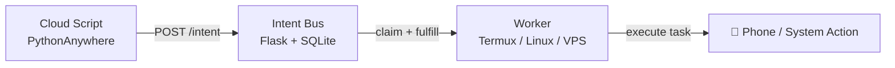

# Intent Bus

[](https://badge.fury.io/py/intent-bus)
[](https://opensource.org/licenses/MIT)

> **Run code on any device from anywhere — using just HTTP.**

A zero-infrastructure job coordination system with retries, atomic locking, and cross-device workers. Built for developers who want something more reliable than cron, without the overhead of Redis, RabbitMQ, or Firebase.

📖 [Why I built this](https://dev.to/d_security/why-i-built-a-job-queue-with-sqlite-instead-of-redis-and-what-i-learned-4f05) · 📱 [Cross-device automation guide](https://dev.to/d_security/how-i-coordinate-scripts-across-devices-without-open-ports-firebase-or-a-vps-1ipi)

---

## What makes this different?

- Trigger your **Android phone from a cloud server**
- Run jobs across devices **without opening ports**
- Build distributed systems using **just HTTP + curl**
- **Hybrid Routing** — keep jobs private, or open them to any worker
- No brokers, no queues, no infrastructure to maintain

No external brokers. Just a minimal Flask + SQLite core.

---

## How it works (30 seconds)

1. A client **POSTs a job** to `/intent`
2. Workers **poll `/claim`** for matching jobs
3. One worker **atomically claims** the job (`BEGIN IMMEDIATE` + `UPDATE ... RETURNING`)
4. Worker executes and calls `/fulfill`
5. If it crashes → job is **requeued after 60 seconds** and retried up to 3 times before being marked failed



---

## Why not just use X?

| Tool | Problem |
|------|---------|
| **Cron** | No coordination, no retries, silent failures |
| **Redis / Celery** | Requires running and maintaining a server |
| **RabbitMQ** | Heavy infra, steep learning curve |
| **Firebase** | Vendor lock-in, SDK bloat, pricing at scale |
| **Intent Bus** | ✅ Single file, deploy anywhere, zero ops |

---

## Who is this for?

- Developers running scripts across multiple machines
- People using **Termux / Android automation**
- Indie hackers avoiding infrastructure complexity
- Anyone who wants job queues without Redis or RabbitMQ

---

## Authentication (Dual-Auth Model)

Intent Bus supports two auth modes:

### Standard Auth (Simple)

```bash
X-API-KEY: your_key_here
```

Works with curl, bash scripts, and IoT devices.

### Strict Auth (Recommended for production)

- HMAC-SHA256 signed requests
- Nonce-based replay protection
- Canonical request serialization
- Handled automatically by the Python SDK

---

## Quickstart (Python SDK)

```bash
pip install intent-bus
```

### Publish a job

```python
from intent_bus import IntentClient

client = IntentClient(api_key="your_key_here")

job = client.publish(
    goal="send_notification",
    payload={"message": "Hello from the cloud"},
    idempotency_key="task_123",  # Prevents double-execution
    # visibility="public"  # Uncomment to allow any worker to claim this job
)

print(job["id"])
```

> **Job Visibility:**
> - `private` *(default)* — only workers using the same API key can claim this job
> - `public` — any authenticated worker on the bus can claim this job, regardless of key
>
> Use `public` when you want to distribute work across a shared worker fleet.
> Omit it (or set `"private"`) to keep jobs scoped to your own workers only.

### Run a worker

```python
from intent_bus import IntentClient

def handler(payload):
    print("Received:", payload["message"])

client = IntentClient(api_key="your_key_here")
client.listen(goal="send_notification", handler=handler)
```

> ⚠️ Workers must be idempotent. The same job may be delivered more than once during retries.

**SDK repo:** [github.com/dsecurity49/Intent-Bus-sdk](https://github.com/dsecurity49/Intent-Bus-sdk)

---

## Quickstart (curl / Bash)

### Publish a job

```bash
curl -X POST https://dsecurity.pythonanywhere.com/intent \
  -H "Content-Type: application/json" \
  -H "X-API-KEY: your_key_here" \
  -d '{"goal":"send_notification","payload":{"message":"Hello"}}'
```

### Claim and fulfill

```bash
# Claim
curl -s -X POST "https://dsecurity.pythonanywhere.com/claim?goal=send_notification" \
  -H "X-API-KEY: your_key_here"

# Fulfill
curl -s -X POST "https://dsecurity.pythonanywhere.com/fulfill/<INTENT_ID>" \
  -H "X-API-KEY: your_key_here"
```

If a job isn't fulfilled within 60 seconds, it is automatically requeued.

---

## Example Use Cases

- Trigger a **phone notification** when a scraper finishes
- Deploy to a **Raspberry Pi behind a firewall** without exposing ports
- Relay alerts to **Discord** from any script
- Replace fragile cron pipelines with loosely coupled workers
- Execute remote commands via Termux without SSH

---

## Features

- **Reliable Delivery** — jobs are retried automatically up to 3 attempts
- **Atomic Locking** — SQLite `BEGIN IMMEDIATE` prevents race conditions
- **Poison Pill Handling** — failed jobs are quarantined after max attempts
- **Idempotency Keys** — prevent duplicate jobs on retry
- **Hybrid Routing** — private by default, optional public execution
- **Rate Limiting** — 60 req/min per API key
- **Ephemeral KV Store** — `/set` and `/get` endpoints
- **Zero-Ops Cleanup** — lazy synchronous GC prevents DB bloat
- **HMAC Signing** — optional replay-protected strict auth mode
- **Admin Dashboard** — live queue stats at `/admin/dashboard`

---

## Architecture Guarantees

- Jobs are **never silently lost**
- Only **one worker** can claim a job at a time
- Workers can **crash safely** without breaking the system
- Delivery is **at-least-once** — workers should be idempotent

---

## ⚠️ Limitations

- SQLite = **single-writer contention** under high load
- Best for **low to medium traffic** (scripts, bots, scrapers, notifications)
- Not a replacement for Kafka or RabbitMQ at scale
- Upgrade path: swap SQLite for PostgreSQL with minimal code changes

---

## Setup

### Option 1 — PythonAnywhere (Free tier)

**Requirement:** SQLite 3.35.0+ (for atomic `RETURNING` clause)

```bash
python -c "import sqlite3; print(sqlite3.sqlite_version)"
```

```bash
git clone https://github.com/dsecurity49/Intent-Bus.git
cd Intent-Bus
pip install -r requirements.txt
export BUS_SECRET="your_key_here"
python flask_app.py
```

**Advanced configuration:**

```bash
export BUS_DB_PATH=/path/to/persistent/infrastructure.db
export DASHBOARD_PASSWORD=your_dashboard_password
export BUS_MAINTENANCE_MODE=false
```

### Option 2 — Docker

```bash
git clone https://github.com/dsecurity49/Intent-Bus
cd Intent-Bus
docker-compose up -d
```

Edit `docker-compose.yml` to set your `BUS_SECRET` and `DASHBOARD_PASSWORD` before running.

> **Note:** The `bus_data` volume must be on local storage. NFS, EFS, or network drives can cause SQLite WAL locking issues.
> If you get a "read-only database" error on first run: `mkdir -p bus_data && chmod 777 bus_data`

### Worker (Termux / Linux)

```bash
# Termux
pkg install jq curl

# Linux
sudo apt install jq curl
```

```bash
echo "your_key_here" > ~/.apikey
chmod 600 ~/.apikey
chmod +x worker.sh
./worker.sh
```

---

## Try It Live

```
https://dsecurity.pythonanywhere.com
```

To get a tester key, open a thread in [GitHub Discussions](https://github.com/dsecurity49/Intent-Bus/discussions) or join the [Discord](https://discord.gg/bzAneAQzGX).

---

## Why I built this

I wanted to trigger scripts on my Android phone from a cloud server — without Firebase, open ports, or complex infrastructure.

So I built a tiny job bus using Flask + SQLite. It worked. And became this project.

---

## Files

| File | Purpose |
|------|---------|
| `flask_app.py` | Core server |
| `worker.sh` | Termux notification worker |
| `logger.sh` | Logging worker |
| `Dockerfile` | Docker container setup |
| `docker-compose.yml` | Docker Compose deployment |
| `Examples/` | Sample workers (Discord, Python) |
| `SPEC.md` | Intent Protocol v1.1 spec |
| `SECURITY.md` | Threat model and key rotation |
| `CONTRIBUTING.md` | Contribution guidelines |

---

## License

MIT
