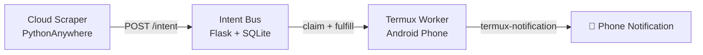

# Intent Bus

POST a job → any script, anywhere, can pick it up and execute it.

A dead-simple SQLite-backed job bus for cross-device script coordination. Built for developers who need something more reliable than cron scripts but don't want the overhead of Redis, RabbitMQ, or Firebase.

---

## Why Intent Bus?

Most automation tools force you to choose between:
- **Too simple:** hardcoded cron jobs with no coordination
- **Too complex:** full message queues that need servers, configs, and maintenance

Intent Bus lives in the gap. A single Flask app + SQLite gives you real job coordination with zero infrastructure overhead.

📖 [Read the full writeup on Dev.to](https://dev.to/d_security/how-i-control-my-android-phone-from-a-cloud-server-using-100-lines-of-flask-2fl6)

---


---
## Example Use Cases

- Run a scraper on a remote server and trigger a notification on your phone when it finishes
- Coordinate multiple scripts without hardcoding dependencies between them
- Replace messy cron pipelines with loosely-coupled workers
- Cross-device automation without Firebase or message queues
- Let a Termux worker on your phone execute jobs posted from a cloud server

---
## Community Workers (Coming Soon)

These worker scripts don't exist yet — PRs welcome.

- **Discord Alert** — claim a `discord_alert` intent, POST to a webhook URL *(example included)*
- **Free SMS Gateway** — claim an `sms_alert` intent, send via `termux-sms-send` on an old Android phone. Zero Twilio costs.
- **Firewall Bypass Deployer** — claim a `trigger_deploy` intent, run `git pull && systemctl restart`. No open ports, no Ngrok.
- **Uptime Watchdog** — push a `discord_alert` intent when a site goes down. Chains with the Discord worker automatically.
- **Telegram Bot** — claim a `telegram_message` intent, send via Bot API
- **Email via SMTP** — claim a `send_email` intent, send via local SMTP config
- **Twilio SMS** — claim a `send_sms` intent, forward payload to Twilio API
- **Webhook Relay** — claim any intent, forward payload to a configurable URL
- **Postgres Backup** — claim a `backup_db` intent, run `pg_dump` locally
---
## How It Works

### 1. Push an Intent

```bash
curl -X POST https://dsecurity.pythonanywhere.com/intent \
  -H "Content-Type: application/json" \
  -H "X-API-Key: your_key_here" \
  -d '{"goal":"send_notification","payload":{"message":"Hello from the cloud"}}'
```

### 2. Claim an Intent (Worker)

Workers poll for jobs matching their goal. The atomic lock ensures only one worker executes each job.

```bash
curl -s -X POST https://dsecurity.pythonanywhere.com/claim?goal=send_notification \
  -H "X-API-Key: your_key_here"
```

Example response:

```json
{
  "id": "abc123",
  "goal": "send_notification",
  "payload": {
    "message": "Hello from the cloud"
  }
}
```

### 3. Fulfill an Intent

```bash
curl -s -X POST https://dsecurity.pythonanywhere.com/fulfill/abc123 \
  -H "X-API-Key: your_key_here"
```

*Note: If an intent is claimed but not fulfilled within 60 seconds, the lock expires and it goes back into the queue automatically.*

---

## Features

* **Atomic locking** — SQLite UPDATE with rowcount check prevents race conditions
* **Topic routing** — workers only claim jobs matching their goal via `?goal=`
* **Auto-requeue** — 60s lock expiry handles crashed workers gracefully
* **Ephemeral key-value store** — bonus `/set` and `/get` endpoints for lightweight clipboard-style state sharing
* **Auth** — all endpoints require an `X-API-Key` header

## Stack

* **Backend:** Flask + SQLite, hosted on PythonAnywhere
* **Workers:** Plain bash scripts (runs anywhere — Termux, VPS, cron)
* *No Docker required*

---

## Setup

### Server (PythonAnywhere)
1. Clone the repo
2. Set your API key as an environment variable in your WSGI config:
   ```python
   import os
   os.environ['BUS_SECRET'] = 'your_key_here'
   ```
3. Deploy `flask_app.py`

### Worker (Termux / any Linux)
1. Install prerequisites:
   ```bash
   pkg install jq curl       # Termux
   sudo apt install jq curl  # Linux
   ```
2. Store your API key and make scripts executable:
   ```bash
   echo "your_key_here" > .apikey
   chmod +x worker.sh logger.sh
   ```
3. Run a worker:
   ```bash
   ./worker.sh
   ```

---

## Files

| File | Purpose |
| :--- | :--- |
| `flask_app.py` | Core Flask server — intent bus + ephemeral store |
| `worker.sh` | Termux worker — listens for `send_notification` intents |
| `logger.sh` | Logger worker — listens for `log_event` intents |
| `SPEC.md` | Intent Protocol v1.0 specification |

---

## Security

All endpoints require an `X-API-Key` header. The key is stored server-side in an environment variable and never committed to the repo. This is a **Phase 1** project — do not store sensitive secrets in payloads.

## License

MIT
