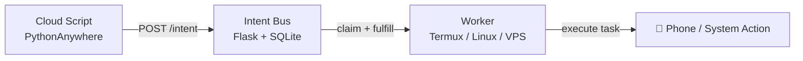

# Intent Bus

[](https://badge.fury.io/py/intent-bus)
[](https://opensource.org/licenses/MIT)

> **Run code on any device from anywhere — using just HTTP.**

A zero-infrastructure job coordination system with retries, atomic locking, priority scheduling, and cross-device workers.
Built for developers who want something more reliable than cron, without the overhead of Redis, RabbitMQ, or Firebase.

[Why I built this](https://dev.to/d_security/why-i-built-a-job-queue-with-sqlite-instead-of-redis-and-what-i-learned-4f05) · 📱 [Cross-device automation guide](https://dev.to/d_security/how-i-coordinate-scripts-across-devices-without-open-ports-firebase-or-a-vps-1ipi)

---

## What makes this different?

- Trigger your **Android phone from a cloud server**
- Run jobs across devices **without opening ports**
- Build distributed systems using **just HTTP + curl**
- **Priority Queues** — high-priority intents are always claimed first
- **Capability Routing** — workers advertise what they can do; jobs require what they need
- **Dead-Letter Queue** — failed jobs are archived, not lost
- No external brokers or managed queue infrastructure required

No external brokers. Just a minimal Flask + SQLite core.

---

## How it works (30 seconds)

1. A client **POSTs a job** to `/intent`
2. Workers **poll `/claim`** for matching jobs
3. One worker **atomically claims** the job and receives a `claim_token`
4. Worker executes and calls `/fulfill/<id>` with the `claim_token`
5. If it crashes, the job is **requeued with exponential backoff** and retried up to `max_attempts` times before being archived to the **dead-letter queue**

Claims are lease-based and automatically expire if a worker disappears before fulfillment.


```mermaid
graph LR
    A[Cloud Script <br/> PythonAnywhere] -->|POST /intent| B[Intent Bus <br/> Flask + SQLite]
    B -->|claim + fulfill| C[Worker <br/> Termux / Linux / VPS]
    C -->|execute task| D[📱 Phone / System Action]
```

---

## Why not just use X?

| Tool | Problem |
|------|---------|
| **Cron** | No coordination, no retries, silent failures |
| **Redis / Celery** | Requires running and maintaining a server |
| **RabbitMQ** | Heavy infra, steep learning curve |
| **Firebase** | Vendor lock-in, SDK bloat, pricing at scale |
| **Intent Bus** | ✅ Single file, deploy anywhere, zero ops |

---

## Who is this for?

- Developers running scripts across multiple machines
- People using **Termux / Android automation**
- Indie hackers avoiding infrastructure complexity
- Anyone who wants job queues without Redis or RabbitMQ

This project is designed for low-to-medium traffic workloads.
With Docker deployment, thousands of jobs per minute are achievable (tested at 13.6 jobs/sec under heavy load).
See **Deployment Capacity & Performance** section for benchmarks.
---

## Authentication

Intent Bus supports two auth modes for regular clients and a separate admin auth layer.

### Standard Auth

```text
X-API-KEY: your_key_here
```

Works with curl, bash scripts, and IoT devices. No replay protection.

### Strict Auth (Recommended for production)

- HMAC-SHA256 signed requests
- Nonce-based replay protection
- Canonical request serialization
- Handled automatically by the Python SDK

Enable globally with `BUS_REQUIRE_SIGNATURES=true`, or let clients opt in by including signature headers.

### Admin Auth

Admin endpoints (`/admin/*`) use a separate privileged credential:

- `X-Admin-Token: <BUS_ADMIN_SECRET>` header, or
- HTTP Basic auth (`admin` / `DASHBOARD_PASSWORD`)

>  **`BUS_ADMIN_SECRET` or HTTP Basic Auth is strictly required for admin access.**

---

## Quickstart (CLI)

The Python SDK ships with a production-ready CLI for terminal interaction.

```bash
pip install intent-bus
export INTENT_API_KEY="your_key_here"
```

### Publish a job

```bash
intent-bus publish send_notification '{"instruction": "Hello"}' -n default
```

### Run a worker from the terminal

```bash
intent-bus listen send_notification -n default -c notify
```

---

## Quickstart (Python SDK)

```bash
pip install intent-bus
```

### Publish a job

`publish()` returns an `IntentStatus` model.

```python
from intent_bus import IntentClient

with IntentClient(api_key="your_key_here") as client:
    published = client.publish(
        goal="send_notification",
        payload={"instruction": "Hello from the cloud"},
        idempotency_key="task_123",
        priority=500,
    )

    print(f"Published: {published.id}")
```

### Job Visibility

- `private` *(default)* — only workers using the same API key as the publisher can claim this job
- `public` — any authenticated worker in the same namespace can claim this job

> ⚠️ Public jobs can be claimed by any authenticated worker in the namespace.
> Do not use `visibility="public"` for sensitive workloads unless every worker on your bus is trusted.

### Run a worker

`claim()` returns a claimed intent model that includes a `claim_token`.

```python
from intent_bus import IntentClient, WorkerRuntime

def handler(job):
    print("Received:", job.payload.get("instruction"))

    return {
        "result": "delivered",
        "result_type": "text",
    }

client = IntentClient(api_key="your_key_here")
runtime = WorkerRuntime(client=client)

runtime.listen(
    goal="send_notification",
    handler=handler,
)
```

>  Workers must be idempotent.
> The same job may be delivered more than once if:
>
> - the worker crashes mid-execution
> - the lease expires before `/fulfill` is called
> - the network drops after the server marks the job fulfilled but before the response arrives
> - the bus retries due to an ambiguous failure

**SDK repo:** https://github.com/dsecurity49/Intent-Bus-sdk

---

## Quickstart (curl / Bash)

### Publish a job

```bash
curl -X POST https://your-bus.render.com/intent \
  -H "Content-Type: application/json" \
  -H "X-API-KEY: your_key_here" \
  -d '{"goal":"send_notification","payload":{"instruction":"Hello"}}'
```

### Publish with priority and delay

```bash
curl -X POST https://your-bus.render.com/intent \
  -H "Content-Type: application/json" \
  -H "X-API-KEY: your_key_here" \
  -d '{"goal":"send_notification","payload":{"instruction":"Urgent"},"priority":900,"delay":5.0}'
```

### Claim and fulfill

```bash
# Claim (returns a claim_token)
curl -s -X POST \
  "https://your-bus.render.com/claim?goal=send_notification" \
  -H "X-API-KEY: your_key_here"

# Fulfill using the returned claim_token
curl -s -X POST \
  "https://your-bus.render.com/fulfill/<INTENT_ID>" \
  -H "Content-Type: application/json" \
  -H "X-API-KEY: your_key_here" \
  -d '{"claim_token":"<TOKEN_FROM_CLAIM>","result":"done","result_type":"text"}'
```

If a job isn't fulfilled within 60 seconds, it is automatically requeued with exponential backoff.

> Workers SHOULD respect the `Retry-After` header after receiving `204 No Content`.
> Tight polling loops create unnecessary SQLite write pressure under concurrency.

---

## Job Lifecycle

```text
open ──► claimed ──► fulfilled
                │
                ▼
              open  (retry with backoff, if attempts remain)
                │
                ▼
              dead ──► dead-letter queue
```

Dead letters can be inspected at `/admin/dead` and retried via `/admin/intents/<id>/retry`.

---

## Smart Routing

### Target a specific worker

```python
client.publish(
    goal="run_backup",
    payload={"instruction": "/data"},
    target_worker="termux-phone-1",
)
```

Worker:

```bash
curl -X POST \
  "https://your-bus.render.com/claim?goal=run_backup" \
  -H "X-API-KEY: key" \
  -H "X-Worker-ID: termux-phone-1"
```

### Require a capability

```python
client.publish(
    goal="transcribe_audio",
    payload={"instruction": "meeting.mp3"},
    required_capability="whisper",
)
```

Worker:

```bash
curl -X POST \
  "https://your-bus.render.com/claim" \
  -H "X-API-KEY: key" \
  -H "X-Worker-Capabilities: whisper,ffmpeg,gpu"
```

Both fields can be combined.
A job with both `target_worker` and `required_capability` must satisfy both conditions before it can be claimed.

---

## Example Use Cases

- Trigger a **phone notification** when a cloud scraper finishes
- Deploy to a **Raspberry Pi behind a firewall** without opening ports
- Relay alerts to **Discord** from any script
- Replace fragile cron pipelines with loosely coupled workers
- Coordinate a heterogeneous worker fleet using capability matching

---

## Features

- **Reliable Delivery** — retries with exponential backoff
- **Atomic Locking** — prevents double-claiming
- **Cryptographic Claim Locks** — ephemeral `claim_token` ownership model
- **Dead-Letter Queue** — failed jobs archived for inspection
- **Priority Scheduling**
- **Namespace Isolation**
- **Worker Targeting**
- **Capability Matching**
- **Delayed Execution**
- **Result Storage**
- **Idempotency Keys**
- **Optional HMAC Signing**
- **Admin Dashboard**
- **Prometheus Metrics**
- **Ephemeral KV Store**

---

## Architecture Guarantees

- Jobs are not silently discarded during normal queue operation
- Only one worker can hold a valid lease at a time
- Claim ownership is enforced cryptographically via ephemeral tokens
- Workers can crash safely — jobs are requeued after lease expiry
- Delivery is at-least-once
- Dead intents are archived, not deleted

---

## ⚠️ Limitations

- SQLite has single-writer contention under high concurrency
- Best for hundreds to low thousands of jobs per minute
- Not a replacement for Kafka or RabbitMQ at massive scale
- PostgreSQL is the natural future upgrade path

---

## Setup

### Option 1 — PythonAnywhere

**Requirement:** SQLite 3.35.0+

```bash
python -c "import sqlite3; print(sqlite3.sqlite_version)"
```

```bash
git clone https://github.com/dsecurity49/Intent-Bus.git
cd Intent-Bus
pip install -r server-requirements.txt
```

### Option 2 — Docker

```bash
git clone https://github.com/dsecurity49/Intent-Bus.git
cd Intent-Bus
mkdir -p bus_data && chmod 755 bus_data
docker-compose up -d
```

---

## Deployment Capacity & Performance (v7.61)

### Benchmarks

Intent Bus has been tested under controlled workloads on Docker/Render:

| Configuration | Workers | Jobs | Success | P99 Latency | Throughput |
|---|---|---|---|---|---|
| **Light** | 5 | 50 | 100% | 0.594s | 3.72 j/s |
| **Medium** | 15 | 500 | 98.75% | 0.517s | 13.27 j/s |
| **Heavy** | 40 | 2000 | 99.01% | 2.586s | 13.62 j/s |

All tests: **0 network errors, 0 lease lost, 0 rate limit errors**

### Deployment Recommendations

#### ✅ Recommended: Docker on Cloud Platform

Deploy using the provided `docker-compose.yml` on platforms like:
- **Render** (tested, works flawlessly)
- **Railway**
- **Fly.io**
- **Heroku**

**Why:** Multi-threaded request handling enables concurrent worker support.

```bash
docker-compose up -d
# Tested to handle 40+ concurrent workers with <3s P99 latency
```

#### ⚠️ Not Recommended: PythonAnywhere Free Tier

PythonAnywhere free tier runs a **single-threaded Gunicorn worker**, which cannot handle concurrent requests. This causes:
- Queue backlog
- Client timeouts
- Apparent "stalled server" errors

**Alternative:** Upgrade to PythonAnywhere Eco ($5/mo) with multi-threaded support, or switch to Docker.

### Safe Operating Limits

Based on v7.61 testing:
- **Safe max concurrent workers:** 40
- **Sustainable throughput:** 13+ jobs/sec (780+ jobs/min)
- **Recommended setup:** Docker with 4+ application threads
- **Default max payload size:** 8KB per intent/result
> **Need larger payloads?** You can easily increase this limit for heavy-data jobs by updating `app.config["MAX_CONTENT_LENGTH"]` and `MAX_PAYLOAD` at the top of `flask_app.py`.

## Environment Variables

| Variable | Default | Description |
|----------|---------|-------------|
| `BUS_SECRET` | — | Main API key |
| `BUS_ADMIN_SECRET` | — | Admin token |
| `DASHBOARD_PASSWORD` | — | Dashboard password |
| `BUS_DB_PATH` | `infrastructure.db` | SQLite DB path |
| `BUS_REQUIRE_SIGNATURES` | `false` | Require HMAC auth |
| `BUS_CLEANUP_INTERVAL_SECONDS` | `21600` | Cleanup interval |
| `BUS_TRUST_PROXY` | — | For Servers behind proxies - set'true'|
---

## API Reference

| Method | Endpoint | Auth | Description |
|--------|----------|------|-------------|
| `POST` | `/intent` | API key | Publish a job |
| `POST` | `/claim` | API key | Claim a job and receive a `claim_token` |
| `POST` | `/fulfill/<id>` | API key | Fulfill a claimed job using `claim_token` |
| `POST` | `/fail/<id>` | API key | Fail a claimed job using `claim_token` |
| `GET` | `/result/<id>` | API key | Get stored result and status |
| `POST` | `/set/<key>` | API key | Set KV entry |
| `GET` | `/get/<key>` | API key | Get KV entry |
| `POST` | `/admin/cleanup` | Admin | Trigger cleanup |

---

## Why I built this

I wanted to trigger scripts on my Android phone from a cloud server — without Firebase, open ports, or complex infrastructure.
So I built a tiny job bus using Flask + SQLite.

Then it kept evolving.

---

## Contributors & Acknowledgements

- **Zan (@ghostframe)** — Security auditing and hardening patches
- **Dhanush (@dsecurity49)** — Creator and maintainer

Interested in contributing? See `CONTRIBUTING.md`.

---

## License

MIT
