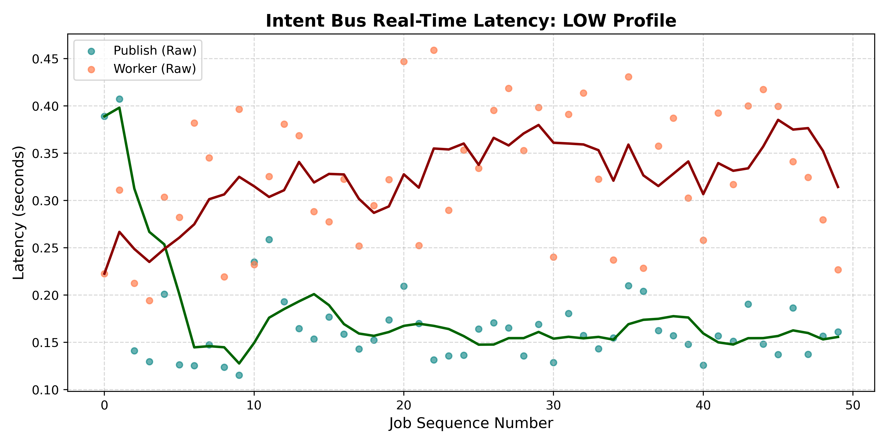
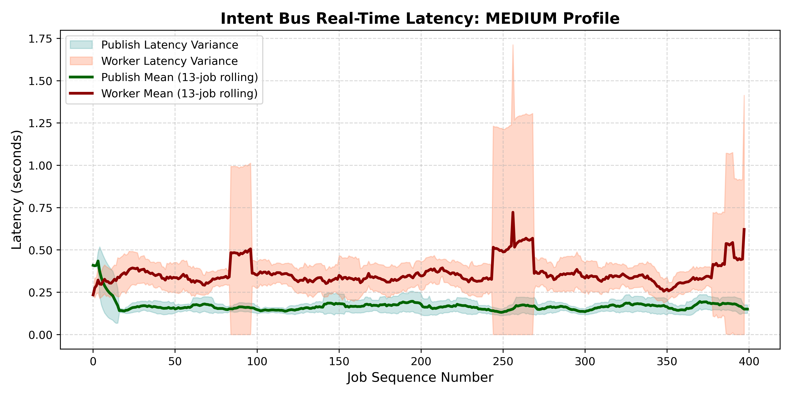
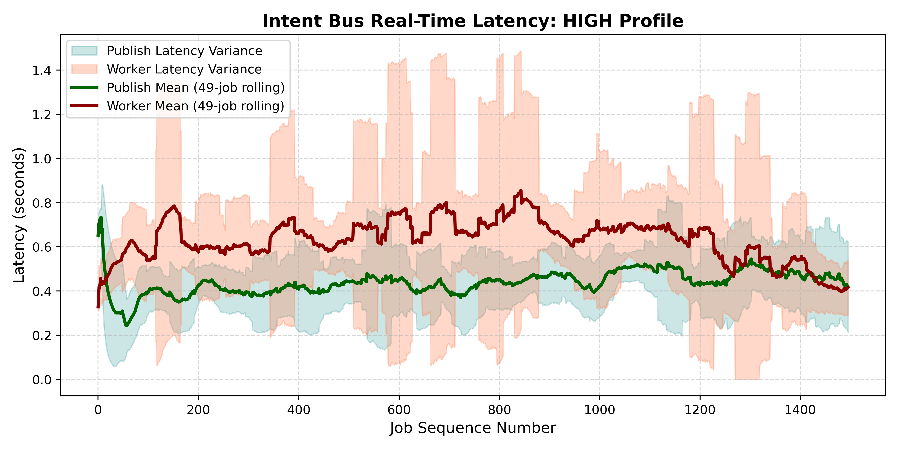
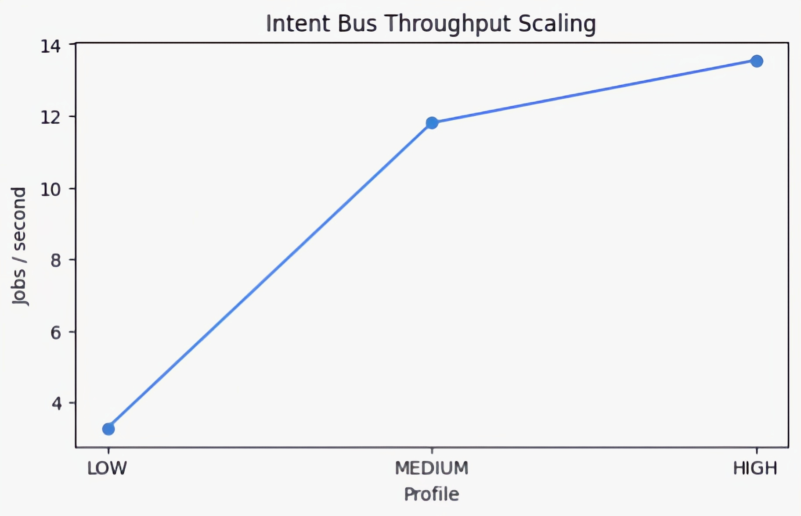

# Intent Bus

[](https://badge.fury.io/py/intent-bus)
[](https://opensource.org/licenses/MIT)

> **Run code on any device from anywhere — using just HTTP.**

Intent Bus is a zero-infrastructure job coordination system with retries, atomic locking, priority scheduling, and cross-device workers.

Built for developers who want something lighter than Redis, RabbitMQ, or Firebase, but more reliable than cron.

•[Why I built this](https://dev.to/d_security/why-i-built-a-job-queue-with-sqlite-instead-of-redis-and-what-i-learned-4f05)
•[Cross-device automation guide](https://dev.to/d_security/how-i-coordinate-scripts-across-devices-without-open-ports-firebase-or-a-vps-1ipi)

---

# What makes this different?

- Trigger your **Android phone from a cloud server**
- Run jobs across devices **without opening ports**
- Coordinate scripts using **just HTTP + curl**
- **Priority queues** so important jobs are claimed first
- **Capability routing** so workers only claim supported jobs
- **Dead-letter queue** so failed jobs are archived instead of disappearing
- No Redis, RabbitMQ, or managed broker required

No external broker. Just a minimal Flask + SQLite core.

---

# How it works

1. A client **POSTs a job** to `/intent`
2. Workers **poll `/claim`**
3. One worker **atomically claims** the job
4. Worker executes and calls `/fulfill/<id>`
5. Failed jobs are retried with exponential backoff
6. Jobs exceeding retry limits move to the dead-letter queue

Claims are lease-based and automatically expire if a worker disappears before fulfillment.


```mermaid
graph LR
    A[Cloud Script] -->|POST /intent| B[Intent Bus]
    B -->|claim + fulfill| C[Worker]
    C -->|execute task| D[Phone / System Action]
```

---

# Why not just use X?

| Tool | Problem |
|------|---------|
| **Cron** | No coordination, no retries, silent failures |
| **Redis / Celery** | Requires running and maintaining infrastructure |
| **RabbitMQ** | Heavier operational complexity |
| **Firebase** | Vendor lock-in, SDK overhead, pricing at scale |
| **Intent Bus** | ✅ Small deployable core with minimal ops |

---

# Who is this for?

- Developers running scripts across multiple machines
- People using **Termux / Android automation**
- Indie hackers avoiding infrastructure complexity
- Anyone wanting job queues without Redis or RabbitMQ

Intent Bus is designed for low-to-medium traffic workloads and performs well under moderate concurrency when deployed with Docker.

---

# Authentication

Intent Bus supports two auth modes for regular clients and a separate admin auth layer.

## Standard Auth

```text
X-API-KEY: your_key_here
```

Works with curl, bash scripts, and lightweight devices.

## Strict Auth

Strict auth supports:

- HMAC-SHA256 signed requests
- Nonce-based replay protection
- Canonical request serialization

The Python SDK handles this automatically.

Enable globally using:

```bash
BUS_REQUIRE_SIGNATURES=true
```

## Admin Auth

Admin endpoints (`/admin/*`) use separate credentials:

- `X-Admin-Token: <BUS_ADMIN_SECRET>`
- HTTP Basic auth

---

# Quickstart (CLI)

```bash
pip install intent-bus
export INTENT_API_KEY="your_key_here"
```

## Publish a job

```bash
intent-bus publish send_notification '{"instruction":"Hello"}' -n default
```

## Run a worker

```bash
intent-bus listen send_notification -n default -c notify
```

---

# Quickstart (Python SDK)

```bash
pip install intent-bus
```

## Publish a job

```python
from intent_bus import IntentClient

with IntentClient(api_key="your_key_here") as client:
    published = client.publish(
        goal="send_notification",
        payload={"instruction": "Hello from the cloud"},
        idempotency_key="task_123",
        priority=500,
    )

    print(f"Published: {published.id}")
```

## Job Visibility

- `private` *(default)* — only workers using the same API key can claim the job
- `public` — any authenticated worker in the namespace can claim it

> Public jobs should only be used in trusted environments.

## Run a worker

```python
from intent_bus import IntentClient, WorkerRuntime

def handler(job):
    print("Received:", job.payload.get("instruction"))

    return {
        "result": "delivered",
        "result_type": "text",
    }

client = IntentClient(api_key="your_key_here")
runtime = WorkerRuntime(client=client)

runtime.listen(
    goal="send_notification",
    handler=handler,
)
```

>  Workers must be idempotent.
> The same job may be delivered more than once if:
>
> - the worker crashes mid-execution
> - the lease expires before `/fulfill` is called
> - the network drops after the server marks the job fulfilled but before the response arrives
> - the bus retries due to an ambiguous failure

**SDK repo:** https://github.com/dsecurity49/Intent-Bus-sdk

---

# Quickstart (curl / Bash)

## Publish a job

```bash
curl -X POST https://your-bus.render.com/intent \
  -H "Content-Type: application/json" \
  -H "X-API-KEY: your_key_here" \
  -d '{"goal":"send_notification","payload":{"instruction":"Hello"}}'
```

## Publish with priority and delay

```bash
curl -X POST https://your-bus.render.com/intent \
  -H "Content-Type: application/json" \
  -H "X-API-KEY: your_key_here" \
  -d '{"goal":"send_notification","payload":{"instruction":"Urgent"},"priority":900,"delay":5.0}'
```

## Claim and fulfill

```bash
# Claim
curl -s -X POST \
  "https://your-bus.render.com/claim?goal=send_notification" \
  -H "X-API-KEY: your_key_here"

# Fulfill
curl -s -X POST \
  "https://your-bus.render.com/fulfill/<INTENT_ID>" \
  -H "Content-Type: application/json" \
  -H "X-API-KEY: your_key_here" \
  -d '{"claim_token":"<TOKEN>","result":"done","result_type":"text"}'
```

If a job is not fulfilled within 60 seconds, it is automatically requeued with exponential backoff.

> Workers should respect the `Retry-After` header after receiving `204 No Content`.

---

# Job Lifecycle

```text
open ──► claimed ──► fulfilled
                │
                ▼
              open (retry with backoff)
                │
                ▼
              dead ──► dead-letter queue
```

Dead letters can be inspected through admin endpoints and retried later.

---

# Smart Routing

## Target a specific worker

```python
client.publish(
    goal="run_backup",
    payload={"instruction": "/data"},
    target_worker="termux-phone-1",
)
```

Worker:

```bash
curl -X POST \
  "https://your-bus.render.com/claim?goal=run_backup" \
  -H "X-API-KEY: key" \
  -H "X-Worker-ID: termux-phone-1"
```

## Require a capability

```python
client.publish(
    goal="transcribe_audio",
    payload={"instruction": "meeting.mp3"},
    required_capability="whisper",
)
```

Worker:

```bash
curl -X POST \
  "https://your-bus.render.com/claim" \
  -H "X-API-KEY: key" \
  -H "X-Worker-Capabilities: whisper,ffmpeg,gpu"
```

Both fields can be combined.

---

# Example Use Cases

- Trigger a phone notification when a cloud scraper finishes
- Deploy to a Raspberry Pi behind a firewall without opening ports
- Relay alerts to Discord from scripts
- Replace fragile cron pipelines with loosely coupled workers
- Coordinate heterogeneous worker fleets

---

# Features

- Reliable delivery with retries
- Atomic locking
- Cryptographic claim tokens
- Dead-letter queue
- Priority scheduling
- Namespace isolation
- Worker targeting
- Capability matching
- Delayed execution
- Result storage
- Idempotency keys
- Optional HMAC signing
- Admin dashboard
- Prometheus metrics
- Ephemeral KV store

---

# Architecture Guarantees

- Jobs are not silently discarded during normal operation
- Only one worker can hold a valid lease at a time
- Workers can crash safely and jobs will be retried
- Delivery is at-least-once
- Dead intents are archived instead of deleted

---

# Limitations

- SQLite has single-writer contention under high concurrency
- Throughput eventually flattens as contention increases
- Tail latency rises under sustained load
- Not intended as a Kafka replacement
- PostgreSQL is the natural future upgrade path

---

# Setup

## Option 1 — PythonAnywhere

Requirement:

```bash
python -c "import sqlite3; print(sqlite3.sqlite_version)"
```

Install:

```bash
git clone https://github.com/dsecurity49/Intent-Bus.git
cd Intent-Bus
pip install -r server-requirements.txt
```

## Option 2 — Docker

```bash
git clone https://github.com/dsecurity49/Intent-Bus.git
cd Intent-Bus
mkdir -p bus_data && chmod 755 bus_data
docker-compose up -d
```

---

# Deployment Capacity & Performance

Recent stress tests on Docker/Render:

| Configuration | Workers | Jobs | Success | P99 Latency | Throughput |
|---|---:|---:|---:|---:|---:|
| **Light** | 5 | 50 | 100.0% | 0.594s | 3.29 j/s |
| **Medium** | 15 | 500 | 99.0% | 1.989s | 11.8 j/s |
| **Heavy** (v7.61 validation) | 40 | 2000 | 99.01% | 2.586s | 13.6 j/s |

Benchmark runs recorded (v7.61 validation run, 2026-05-24):

- 0 network errors
- 0 lease lost
- 0 rate limit errors

Higher concurrency increases tail latency, but the system remains stable under sustained contention.

---

# Performance Benchmarks

## Low Profile

Light automation workloads with tightly clustered latency.



## Medium Profile

Moderate queue contention with graceful SQLite WAL lock waiting.



## High Profile

Sustained concurrent polling and fulfillment with increased tail latency under load.



## Throughput Graph



---

# Deployment Recommendations

## Recommended

Deploy with Docker on:

- Render
- Railway
- Fly.io
- Heroku

Multi-threaded deployments handle concurrent worker polling more comfortably.

## Not Ideal

PythonAnywhere free tier is not well suited for high-concurrency worker polling because a single-threaded app process can create backlog under sustained load.

---

# Safe Operating Limits

Based on current testing:

- Safe concurrent workers: ~40
- Sustained throughput: 13+ jobs/sec in tested environments
- Recommended deployment: Docker with multiple app threads
- Default payload size: 8KB per intent/result

Larger payloads can be enabled by increasing:

```python
app.config["MAX_CONTENT_LENGTH"]
MAX_PAYLOAD
```

---

# Environment Variables

| Variable | Description |
|----------|-------------|
| `BUS_SECRET` | Main API key |
| `BUS_ADMIN_SECRET` | Admin token |
| `DASHBOARD_PASSWORD` | Dashboard password |
| `BUS_DB_PATH` | SQLite DB path |
| `BUS_REQUIRE_SIGNATURES` | Require HMAC auth |
| `BUS_CLEANUP_INTERVAL_SECONDS` | Cleanup interval |
| `BUS_TRUST_PROXY` | Enable proxy trust |

---

# API Reference

| Method | Endpoint | Description |
|--------|----------|-------------|
| `POST` | `/intent` | Publish a job |
| `POST` | `/claim` | Claim a job |
| `POST` | `/fulfill/<id>` | Fulfill a claimed job |
| `POST` | `/fail/<id>` | Fail a claimed job |
| `GET` | `/result/<id>` | Fetch stored result |
| `POST` | `/set/<key>` | Set KV entry |
| `GET` | `/get/<key>` | Get KV entry |
| `POST` | `/admin/cleanup` | Trigger cleanup |

---

# Why I built this

I wanted to trigger scripts on my Android phone from a cloud server without Firebase, open ports, or complex infrastructure.

So I built a tiny job bus using Flask + SQLite.

---

# Contributors

- **Zan (@ghostframe)** — Security auditing and hardening
- **Dhanush (@dsecurity49)** — Creator and maintainer

---

# License

MIT
